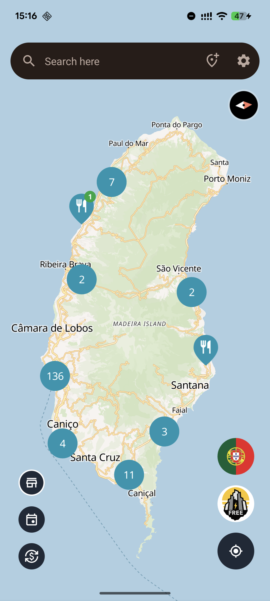
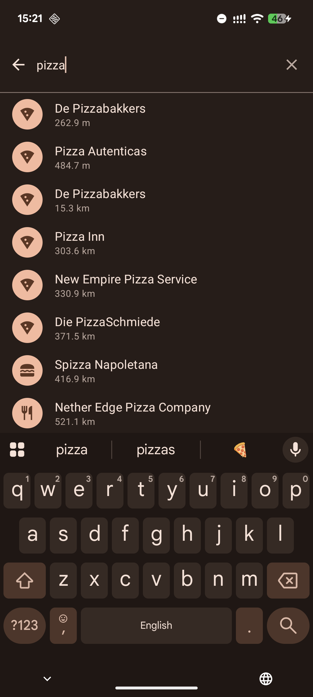
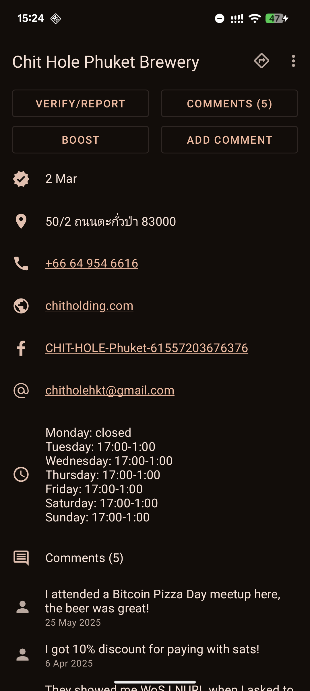
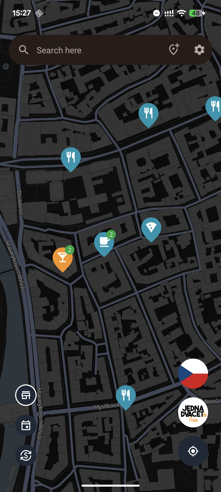

 
<h2 align="center"><b>BTC Map</b></h2>
<h4 align="center">Find places to spend sats wherever you are</h4>

  

## Screenshots

## Support BTC Map

[btcmap.org/support-us](https://btcmap.org/support-us)

## 🌍 Help with Translation

In order to translate the app to your language, you should click on a language link below and then
press an edit button.

- [Afrikaans](app/src/main/res/values-af/strings.xml)
- [Arabic](/app/src/main/res/values-ar/strings.xml)
- [Bengali](/app/src/main/res/values-bn/strings.xml)
- [Bulgarian](/app/src/main/res/values-bg/strings.xml)
- [Catalan](/app/src/main/res/values-ca/strings.xml)
- [Chinese](/app/src/main/res/values-zh/strings.xml)
- [Czech](/app/src/main/res/values-cs/strings.xml)
- [Danish](/app/src/main/res/values-da/strings.xml)
- [Dutch](/app/src/main/res/values-nl/strings.xml)
- [English](/app/src/main/res/values/strings.xml)
- [Finnish](/app/src/main/res/values-fi/strings.xml)
- [French](/app/src/main/res/values-fr/strings.xml)
- [German](/app/src/main/res/values-de/strings.xml)
- [Greek](/app/src/main/res/values-el/strings.xml)
- [Hebrew](/app/src/main/res/values-iw/strings.xml)
- [Hindi](/app/src/main/res/values-hi/strings.xml)
- [Hungarian](/app/src/main/res/values-hu/strings.xml)
- [Italian](/app/src/main/res/values-it/strings.xml)
- [Japanese](/app/src/main/res/values-ja/strings.xml)
- [Korean](/app/src/main/res/values-ko/strings.xml)
- [Norwegian](/app/src/main/res/values-no/strings.xml)
- [Persian](/app/src/main/res/values-fa/strings.xml)
- [Polish](/app/src/main/res/values-pl/strings.xml)
- [Portuguese](/app/src/main/res/values-pt/strings.xml)
- [Portuguese (Brazil)](/app/src/main/res/values-pt-rBR/strings.xml)
- [Romanian](/app/src/main/res/values-ro/strings.xml)
- [Russian](/app/src/main/res/values-ru/strings.xml)
- [Serbian](/app/src/main/res/values-sr/strings.xml)
- [Spanish](/app/src/main/res/values-es/strings.xml)
- [Swedish](/app/src/main/res/values-sv/strings.xml)
- [Thai](/app/src/main/res/values-th/strings.xml)
- [Turkish](/app/src/main/res/values-tr/strings.xml)
- [Ukrainian](/app/src/main/res/values-uk/strings.xml)
- [Urdu](/app/src/main/res/values-ur/strings.xml)
- [Vietnamese](/app/src/main/res/values-vi/strings.xml)

Feel free to open an issue if you can't find your language or regional dialect.

## FAQ

### Where does BTC Map take its data from?

The data is provided by OpenStreetMap:

https://www.openstreetmap.org

### Can I add or edit places?

Absolutely, you are very welcome to do that. This is a good place to start:

[Tagging Instructions](https://gitea.btcmap.org/teambtcmap/btcmap-general/wiki/Tagging-Merchants)

### BTC Map shows a place which doesn't exist, how can I delete it?

You can delete such places from OpenStreetMap and BTC Map will pick up all your changes within 10
minutes.

### I've found a place on BTC Map but it doesn't accept bitcoins

OpenStreetMap might have outdated information about some places, you can delete the `currency:XBT`
tag or set it to `no` in order to remove this place from BTC Map.
