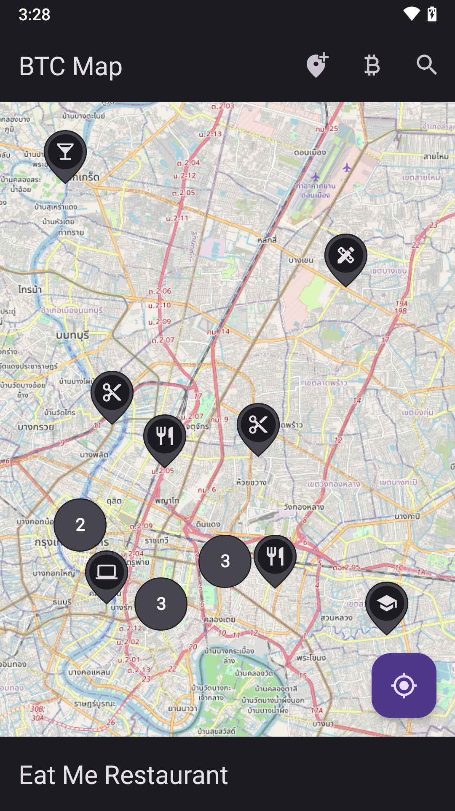

<p align="center"></p> 
<h2 align="center"><b>BTC Map</b></h2>
<h4 align="center">See where you can spend your bitcoins</h4>

<p align="center">
  <a href="https://f-droid.org/packages/org.btcmap/">
    
  </a>
</p>

<p align="center">
<a href="https://github.com/bubelov/btcmap-android/releases" alt="GitHub release"></a>
<a href="https://www.gnu.org/licenses/gpl-3.0" alt="License: GPLv3"></a>
<a href="https://github.com/bubelov/btcmap-android/actions" alt="Build Status"></a>
</p>

## Screenshots

<div>



</div>

## Support BTC Map

bc1qng60mcufjnmz6330gze5yt4m6enzra7lywns2d


## FAQ

### Where does BTC Map take its data from?

The data is provided by Open Street Map:

https://www.openstreetmap.org

### Can I add or edit places?

Totally, you are very welcome to do that. This is a good place to start with: 

https://wiki.openstreetmap.org/wiki/How_to_contribute

### BTC Map shows a place which doesn't exist, how can I report it?

You can delete such places from Open Street Map and BTC Map will pick up all your changes within 24 hours

### I've found a place on BTC Map but it doesn't accept bitcoins

Open Street Map might have outdated information about some places, you can delete the following tags to remove this place from BTC Map:

```
currency:XBT
currency:BTC
payment:bitcoin
```
