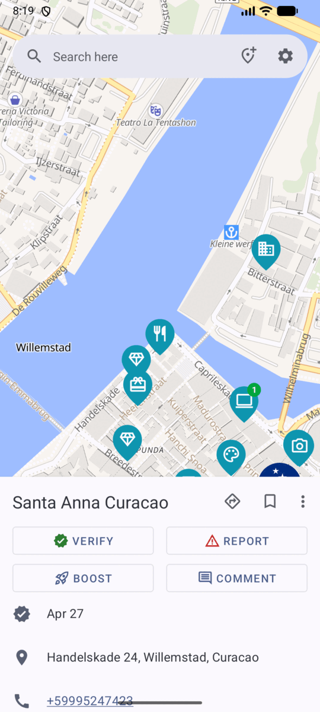
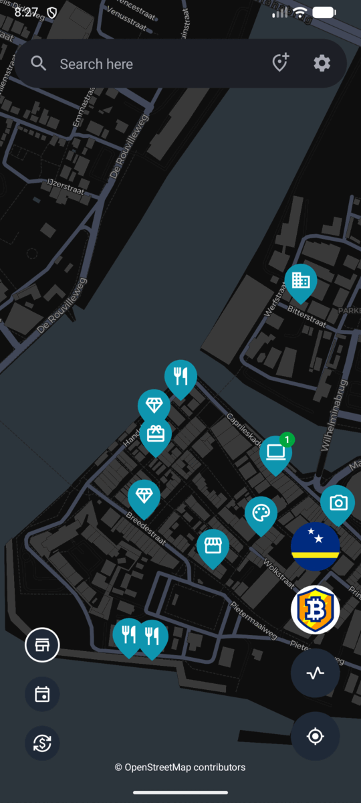

# Getting started

This guide takes you from installing BTC Map to exploring the bitcoin world
around you — places to spend sats, local communities, and the meetups and
conferences happening near you.

## Install the app

BTC Map runs on **Android 10 and newer**. Every official download is listed on
[btcmap.org/apps](https://btcmap.org/apps); pick whichever source you prefer:

- **F-Droid** — install from the
  [BTC Map page on F-Droid](https://f-droid.org/packages/org.btcmap/). The store
  manages updates for you.
- **Zapstore** — install from
  [zapstore.dev/apps/org.btcmap](https://zapstore.dev/apps/org.btcmap).
- **Obtainium** — install and update BTC Map straight from its release page.
  First install [Obtainium](https://obtainium.imranr.dev/), then add BTC Map's
  [GitHub releases page](https://github.com/teambtcmap/btcmap-android/releases)
  as a source; Obtainium checks it and notifies you when a new release is out.
  To follow the beta instead, add the direct APK URL
  `https://static.btcmap.org/android/apk/beta.apk` as the source.
- **Direct APK** — download the APK and open it:
  - [Latest release](https://static.btcmap.org/android/apk/latest.apk) —
    the stable build, also linked as **APK** on
    [btcmap.org/apps](https://btcmap.org/apps).
  - [Latest beta](https://static.btcmap.org/android/apk/beta.apk) — the
    pre-release build, also linked as **APK (Beta)**. See
    [Trying the beta](#trying-the-beta) below.

  When installing a direct APK you may need to allow your browser or file
  manager to install unknown apps. If you install this way, the app also
  notifies you when a newer build is available and offers a **Get APK** button.
- **GitHub releases** — browse every published build on the
  [releases page](https://github.com/teambtcmap/btcmap-android/releases).

The APKs distributed directly by the BTC Map team — the direct downloads and
GitHub releases — are signed with the team's release key, and you can check the
signature as described in the
[README](../README.md#verifying-signatures). Builds installed from F-Droid are
signed by F-Droid with its own key instead, so that fingerprint does not apply
to them.

## Trying the beta

The stable release is the safe choice for everyday use. If you would like to
help shape BTC Map, the beta build is for you: it gets new features and fixes
before the stable release, and we depend on beta testers to catch problems
early. There is no sign-up, invite or waiting list — just install it.

- **Download it at**
  [static.btcmap.org/android/apk/beta.apk](https://static.btcmap.org/android/apk/beta.apk),
  or use the **APK (Beta)** link on
  [btcmap.org/apps](https://btcmap.org/apps).
- **It sits next to the stable app; it does not replace it.** The beta is a
  separate app with its own Android application id (`org.btcmap.beta`, versus
  `org.btcmap` for the stable release), so both can be installed at the same
  time. You can keep using the stable app for everyday navigation and open the
  beta whenever you want to try what is coming next.
- **It is easy to tell apart.** The beta is named **BTC Map Beta** and uses a
  distinct app icon.
- **Each app updates on its own.** Installing, updating or uninstalling one has
  no effect on the other, and removing the beta leaves your stable app and its
  data untouched.
- **What we ask of testers.** Use it like you normally would, and when something
  looks wrong or you have an idea, tell us. Report bugs or suggestions on
  [GitHub](https://github.com/teambtcmap/btcmap-android/issues) or say hello in
  our [Matrix room](https://matrix.to/#/#btcmap:matrix.org).

The stable and beta APKs from the direct downloads above share the same release
key, so you can verify either one as described in the
[README](../README.md#verifying-signatures).

## First launch

When the app opens for the first time, it shows the map with a snapshot of
places, areas, events and comments that ships with the app. That means it is
usable immediately, even before the first sync finishes or while you are
offline.

The app then syncs in the background to bring the data up to date. A small
spinning indicator appears at the bottom left while this is happening; it is
normal on the first launch or after a while without a connection.

Tap any marker to open that place's details in a card along the bottom of the
screen.

With the card dismissed, the map shows the controls for browsing what is around
you:

- The three buttons along the bottom left switch what the map shows:
  **places**, **events** and **exchanges** (bitcoin ATMs and currency
  exchanges).
- The chips on the right list the **areas** covering the current view: the
  country at the top, then any local communities below it. Tapping one opens
  that area's page.

## Permissions

- **Network** — required to sync data and load map tiles and images.
- **Location (optional)** — used only to show where you are on the map and to
  centre it on you. The app works fine if you deny it, and you can grant it
  later.

You can grant location from the **locate button** on the map; the app asks only
when you use it.

## Finding your way around

The **map** is the home screen. From top to bottom:

- The **search field** at the top: type a place, area or event name to search.
  The menu next to it has **Add location** and **Settings**.
- The **filter chips** at the bottom: **Merchants**, **Events** and
  **Exchanges** switch what is shown on the map.
- **Area chips** above the filters: the community or country you are currently
  looking at. Tap one to open its page.
- The **locate button** to centre the map on your position.
- The **activity button** to see recent changes nearby.

Tap any marker to open a card with the place's details at the bottom of the
screen.

## Try it out

A short path through the most common tasks:

1. **Find a nearby merchant.** Tap the locate button, then tap a marker. The
   card shows the name, address, opening hours, whether it was recently
   verified, and how to get there.
2. **Get directions.** Open a place and choose **Directions** from its menu to
   hand the coordinates to your maps app.
3. **Confirm a place still accepts bitcoin.** Open a place and tap **Verify**.
   Your report is reviewed by the BTC Map community.
4. **Add a missing place.** Tap **Add location** in the top menu, fill in the
   details and drag the map to set the exact spot, then submit it for review.
5. **Leave a note for others.** Open a place and tap **Comment**. Comments are
   anonymous but carry a small fee in sats as spam protection, paid with a
   Lightning wallet.
6. **Support a merchant.** Open a place and tap **Boost** to make it stand out
   on the map, in search and in the boosted section.

An account is needed for verifying, reporting, adding places, saving places and
areas, and following other users. Comments and boosts do not require one.
See [Accounts and saved items](features/accounts.md) for details.

## Using the app offline

All of the app's data is cached on your device, so search, place details, areas
and events keep working without a connection. To also keep the map itself, open
an area and download its tiles for offline use — see
[Offline maps](features/offline-maps.md).

## Where to go next

- Browse the [feature guides](index.md#feature-guides).
- Learn how to help improve the data with the
  [BTC Map tagging instructions](https://wiki.btcmap.org/Tagging-Merchants).
- Support the project at
  [btcmap.org/support-us](https://btcmap.org/support-us).

Back to the [documentation index](index.md).
