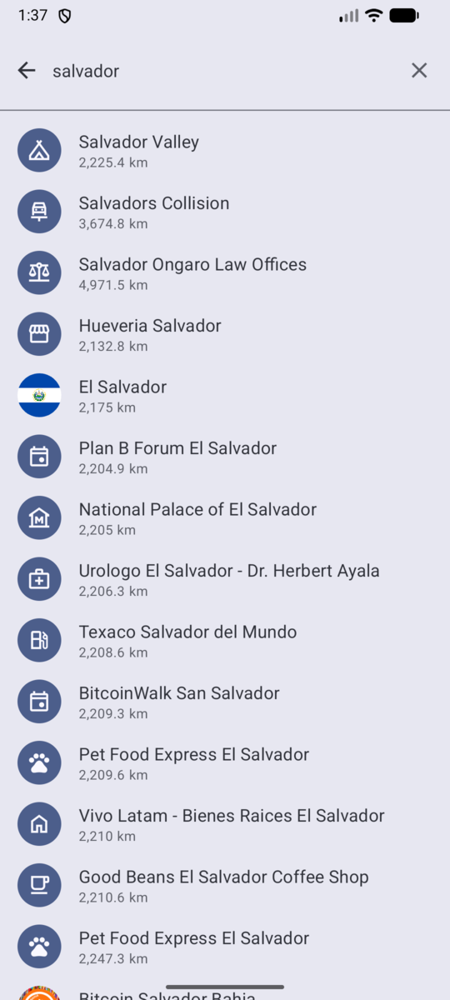
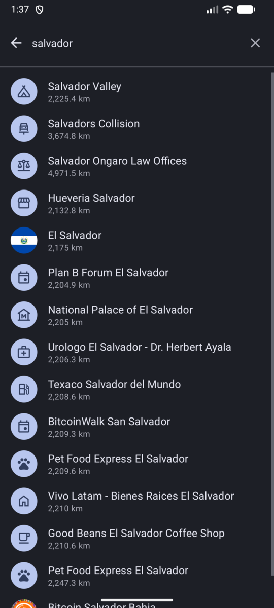

# Search

The search field sits at the top of the map. It searches the data already
stored on your device, so results are immediate and work without a connection.

## What can be searched

Type a name into the search field and the app looks through:

- **Places** — merchants, ATMs and exchanges.
- **Areas** — communities and countries.
- **Events** — meetups and other events.

Results appear below the field as you type. A short pause is applied before the
search runs, so the list keeps up while you type.

## How results are ordered

Results prefer what is close to the middle of the map. Move the map to the area
you care about before searching to get more relevant hits.

## Opening a result

What happens depends on the kind of result:

- A **place** opens its card at the bottom of the map and moves the map to it.
  The correct filter is selected automatically.
- An **area** zooms the map to its bounding box. Opening the area chip then
  takes you to its full page.
- An **event** opens the event screen.

Once you pick a result, the search field is cleared and the keyboard is
dismissed so you can see the map.

## Offline behaviour

Because search reads from the local database, it keeps working offline, and it
stays fast regardless of how large the synced data is.

---

Next: [Common actions](try-it-out.md).

Back to the [documentation index](../index.md).
